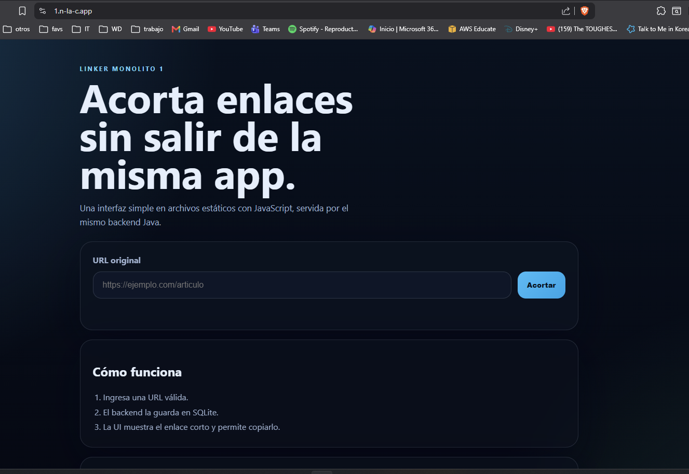

[](https://github.com/co-eiv-devsecops/linker1/actions/workflows/ci.yml)
[](https://github.com/co-eiv-devsecops/linker1/actions/workflows/pipeline.yml)
[](https://github.com/co-eiv-devsecops/linker1/actions/workflows/release.yml)

# Linker1

A simple URL shortener built with **Java** and **Javalin**, with a SQLite database and a static frontend.

## What is it?

Linker1 is a web application that lets you:

- Enter a long URL
- Generate a short code (8 characters) or set a **custom alias**
- Automatically redirect when you visit the short code or the alias

## API

- `POST /link` — Creates a short link. JSON body: `{"url": "https://..."}`. If the URL already existed, responds `200` with the same code; if it's new, responds `201`.
  - Custom alias (optional): `{"url": "https://...", "alias": "my-alias"}`. Alias rules: letters, numbers, hyphen (`-`), and underscore (`_`) only, between 1 and 64 characters, no spaces. If the alias is already taken by another URL, responds `409`; if the alias is invalid, responds `400`.
- `GET /{id}` — Redirects (`301`) to the URL associated with the short code or alias. Responds `404` if it doesn't exist.

## Requirements

- **Java 21**
- **Maven 3.7+**
- **Git**

## Installation and Running on the VM

### 1. Clone the repository

```bash
git clone <repo-url>
cd linker1
```

### 2. Build the project

```bash
mvn clean package
```

### 3. Run the application

```bash
java -jar target/linker1-1.0-jar-with-dependencies.jar
```

The application will be available at `http://localhost:8080`

### 4. Deployment

A script was created to make deployment simpler; the only thing needed is to have the repo cloned on the VM and run:

```bash
bash deploy.sh
```

This script:

- Pulls changes from the repo
- Installs dependencies (Java, Maven, Nginx)
- Builds the project
- Configures the systemd service
- Starts Nginx as a reverse proxy
- Exposes the application on port 8080

### 5. Environment parity (IaC)

Besides manual deployment with `deploy.sh`, the project includes infrastructure as code in `infra/` using Terraform, which lets you create a new VM with everything needed to run Linker1 reproducibly.

**What it creates:** a compute instance on OCI (same subnet and compartment as the team), automatically configured via cloud-init: installs Java 21, Maven, Nginx, clones the repo, builds it, and leaves the service running — no manual steps.

**Requirements:** Terraform >= 1.5, access to OCI (via OCI Cloud Shell, which already comes authenticated).

**Usage:**

```bash
cd infra
cp terraform.tfvars.example terraform.tfvars
# Fill in terraform.tfvars with your values (compartment_id, subnet_id, image_id, ssh_public_key)
terraform init
terraform plan
terraform apply
```

**Tearing down the environment:**

```bash
terraform destroy
```

---

### Verifying it's working

You should see the static page at the URL:

```bash
https://1.n-la-c.app/
```

Like this:



## Pipeline and quality

The CI pipeline (`.github/workflows/ci.yml`) runs on every `push` to `main`/`DEV` and on every `pull_request`, with these jobs:

- **Build**: compiles the code (`mvn compile`).
- **Tests**: runs unit and integration tests (`mvn test`), and enforces the coverage threshold with JaCoCo (`mvn verify`).
- **Package**: produces the executable jar (`target/linker1-1.0-jar-with-dependencies.jar`) along with a launcher script (`scripts/linker1`).
- **Summary**: confirms the packaged artifact exists and is executable.
- **Smoke Test**: downloads the packaged jar, boots it, and live-tests the main routes (static assets, create link, alias, redirect, 404).
- **API Tests (Live)**: only on `push` to `main`/`DEV`, runs a Postman collection with [Newman](https://github.com/postmanlabs/newman) against the deployed instance (`https://1.n-la-c.app/`). Doesn't run on pull requests so it doesn't touch the shared production environment.
- **Publish GitHub Package**: on `push` to `main`/`DEV`, publishes the built jar to **GitHub Packages** (see below).

`main` and `DEV` are both protected: they require at least one approval and the Build/Tests/Package/Summary/Smoke Test checks to pass before a merge is allowed. See [`docs/BRANCH_PROTECTION.md`](docs/BRANCH_PROTECTION.md) for the full configuration and rationale.

### GitHub Packages

Every push to `main`/`DEV` publishes the built jar as a Maven package to **GitHub Packages** (`https://maven.pkg.github.com/co-eiv-devsecops/linker1`), configured via `distributionManagement` in `pom.xml`. Each CI-published version gets a unique, collision-free identifier (`<base-version>-ci.<run-number>.<short-sha>`), so re-running CI never conflicts with a previously published package. This gives the team a versioned, downloadable artifact history independent of GitHub Releases.

### Continuous deployment

Every `push` to `main` also triggers `.github/workflows/pipeline.yml`, which builds the jar, deploys it to the production VM through an OCI Bastion (the VM has no public IP), validates that the service responds, and automatically rolls back to the previous stable tag if anything fails. Full details (jobs, required secrets, bastion mechanism) are in [`docs/DEPLOYMENT.md`](docs/DEPLOYMENT.md); the rollback strategy is in [`docs/ROLLBACK_STRATEGY.md`](docs/ROLLBACK_STRATEGY.md).

## Releases (GitHub Release)

The project includes a release workflow at `.github/workflows/release.yml` that automatically creates a **GitHub Release** and attaches ready-to-download artifacts.

### When does it run?

- Automatic: when a tag in `vMAJOR.MINOR.PATCH` format is pushed (e.g. `v1.2.3`).
- Manual: from **Actions > Release > Run workflow**, specifying an existing tag in that format.

### What does it validate and publish?

Before publishing, the workflow runs:

- `mvn clean verify` (build, tests, and the coverage rule)
- `mvn package -DskipTests`

It then creates/updates the Release and attaches:

- `linker1-1.0-jar-with-dependencies.jar`
- `linker1` (Linux launcher script)

### Recommended versioning flow

1. Create a semantic tag:

   ```bash
   git tag v1.2.3
   git push origin v1.2.3
   ```

2. Wait for the **Release** workflow to finish.
3. Verify in **GitHub > Releases** that:
   - the `Linker1 v1.2.3` release exists
   - both artifacts are attached
   - the automatic release notes were generated (and optionally edit them)

### Feature flagging

The frontend has two versions, `public/v1/` (default) and `public/v2/` (a themed redesign), and which one gets served is decided at request time by a **LaunchDarkly** feature flag (`new-ui`), not by a build-time switch or a hardcoded environment variable. `src/linker/config/FeatureFlags.java` wraps a real `LDClient` behind a small interface (`isNewUiEnabled()`); `Main.java` builds the LaunchDarkly client once at startup (reading `LD_SDK_KEY`, refusing to start if it's missing) and injects `FeatureFlags` into `StaticRoutes` via its constructor, which then picks `v1` or `v2` per request. This lets the team ship the new UI as code, then turn it on for real users progressively from the LaunchDarkly dashboard — without a deploy — and phase out the old ("bad") code path once the new one is confirmed healthy. See [`docs/FEATURE_FLAGS.md`](docs/FEATURE_FLAGS.md) for the full design.

### Test coverage

The project uses [JaCoCo](https://www.jacoco.org/jacoco/) to measure code coverage. The target is 100% line coverage (excluding `Main.class`, the entry point that opens a real database connection and starts a real server — conventionally excluded from unit coverage metrics). The report is generated in `target/site/jacoco/` via `mvn verify`.

### API tests with Postman/Newman

The `postman/linker1.postman_collection.json` collection covers: static routes, link creation (valid case, duplicate, invalid URL), alias (valid case, taken alias, invalid alias), and redirection (by id, by alias, 404). To run it locally:

```bash
npx newman run postman/linker1.postman_collection.json --env-var "baseUrl=http://localhost:8080"
```

## Observability

Linker1 is instrumented with the [OpenTelemetry Java SDK](https://opentelemetry.io/docs/languages/java/): logs (via SLF4J/Logback, bridged into OpenTelemetry), metrics (2 counters, 2 gauges, 2 histograms covering the RED method plus system-level gauges), and traces (2 traces, each with a parent and a child span) around link creation and resolution. All of it is manual/programmatic instrumentation — explicit calls in `src/`, not the auto-instrumentation javaagent — built around a small reusable library (`linker.telemetry`) so the rest of the codebase touches it through a handful of narrow, constructor-injected classes instead of the raw OpenTelemetry API.

- **Verbosity**: controlled by the `LOG_LEVEL` environment variable, read at process startup — the same deployable jar can run at any verbosity without a rebuild. See [`docs/LOGGING.md`](docs/LOGGING.md).
- **Metrics, traces, and the instrumentation library's design**: see [`docs/INSTRUMENTATION.md`](docs/INSTRUMENTATION.md).
- **Exporting to a backend (e.g. Grafana Cloud)**: set `OTEL_EXPORTER_OTLP_ENDPOINT` (and `OTEL_EXPORTER_OTLP_HEADERS` for auth) — standard OpenTelemetry environment variables, no custom config mechanism. Left unset, the app runs normally with OTLP export simply failing silently in the background rather than refusing to start.

### Health check

`GET /healthz` runs `SELECT 1` against a MySQL connection (configured via `MYSQL_HOST`/`MYSQL_DATABASE`/`MYSQL_USER`/`MYSQL_PWD`) and returns `200 OK` or `503 Unhealthy: <detail>`, wrapped in its own `mysql.healthcheck` server-kind span. This is separate from Linker1's actual datastore (SQLite) — it exists purely so external monitors (e.g. Grafana Cloud Synthetic Monitoring) can poll a single endpoint to verify the deployed instance's MySQL dependency is reachable. See [`docs/HEALTHCHECK.md`](docs/HEALTHCHECK.md).

## Running with a Dev Container (Visual Studio Code)

As an alternative to a local install, the project can be run using a **Dev Container**. This option provides a reproducible development environment and avoids manually installing the project's dependencies on your machine.

### Dev Container requirements

- Docker Desktop (Windows/macOS) or Docker Engine (Linux).
- Visual Studio Code.
- Microsoft's **Dev Containers** extension.

### 1. Open the project in the Dev Container

With the repository already cloned and open in Visual Studio Code:

1. Press `Ctrl + Shift + P`.
2. Run the command:

```text
Dev Containers: Reopen in Container
```

If this is the first time the project is opened this way, Visual Studio Code will automatically build the container image and set up the development environment.

> **Note:** This process can take a few minutes depending on your machine's performance and internet connection speed.

### 2. Wait for the environment to be set up

Once the container is built, Visual Studio Code will reopen the project inside the configured development environment.

All the dependencies the project needs will be available automatically.

### 3. Build the project

From Visual Studio Code's integrated terminal, run:

```bash
mvn clean package
```

### 4. Run the application

In the same terminal, run:

```bash
java -jar target/linker1-1.0-jar-with-dependencies.jar
```

### 5. Test the application

Open a browser and go to:

```text
http://localhost:8080
```

### 6. Validate that it works

1. Enter a complete URL (for example: `https://www.google.com`).
2. Generate the short link.
3. Copy the generated code.
4. Go to:

```text
http://localhost:8080
```

to verify the redirect works correctly.

### Rebuilding the Dev Container

If changes are made to the `Dockerfile` or `devcontainer.json`, rebuild the environment from the command palette (`Ctrl + Shift + P`) by running:

```text
Dev Containers: Rebuild and Reopen in Container
```

## Project Structure

```text
linker1/
├── .github/                      # CI workflows and community health files
│   ├── workflows/
│   │   ├── ci.yml                 # Pipeline: build, tests, package, summary, smoke test, API tests, GitHub Package publish
│   │   ├── pipeline.yml           # Continuous deployment: build, deploy-prod, validate-prod, rollback
│   │   └── release.yml            # GitHub Release on vMAJOR.MINOR.PATCH tags
│   ├── CONTRIBUTING.md            # Collaboration standards (branching, TDD, PRs)
│   ├── PULL_REQUEST_TEMPLATE.md
│   ├── ISSUE_TEMPLATE/            # Bug report / feature request templates
│   └── CODEOWNERS
├── docs/                          # Deployment, rollback, branch protection, and observability docs
│   ├── DEPLOYMENT.md
│   ├── ROLLBACK_STRATEGY.md
│   ├── BRANCH_PROTECTION.md
│   ├── FEATURE_FLAGS.md
│   ├── LOGGING.md                 # LOG_LEVEL configuration
<<<<<<< HEAD
│   ├── INSTRUMENTATION.md         # OpenTelemetry metrics/traces/logs design
│   └── HEALTHCHECK.md             # GET /healthz: MySQL SELECT 1, span, Grafana Synthetic Monitoring
=======
│   └── INSTRUMENTATION.md         # OpenTelemetry metrics/traces/logs design
>>>>>>> 3217c524b03feaf1187cd4485ef575c1073bf5b7
├── infra/                        # Infrastructure as code (Terraform)
│   ├── main.tf
│   ├── variables.tf
│   ├── provider.tf
│   ├── outputs.tf
│   ├── cloud-init.yaml
│   └── terraform.tfvars.example
├── resources/
│   └── logback.xml                # Logging config: console + OTel appenders, LOG_LEVEL-driven verbosity
├── src/
│   ├── Main.java                  # Bootstrap: DB, telemetry SDK, LaunchDarkly client, Javalin server, route registration
│   └── linker/                    # Business logic and data access
│       ├── Link.java
│       ├── LinkService.java       # Validation, id generation, alias
│       ├── LinkRepository.java    # JDBC access to SQLite
│       ├── AliasConflictException.java
│       ├── config/
│       │   └── FeatureFlags.java  # LaunchDarkly wrapper, injected via constructor
│       ├── telemetry/             # OpenTelemetry wrappers, injected via constructor
│       │   ├── Telemetry.java     # Builds the OpenTelemetry SDK from OTEL_* env vars
│       │   ├── RequestMetrics.java  # RED-method HTTP counters/histogram
│       │   ├── LinkSpans.java     # Traces for link create/resolve + DB duration histogram
│       │   └── SystemMetrics.java  # Link-count and JVM heap gauges
<<<<<<< HEAD
│       ├── health/                # MySQL healthcheck, injected via constructor
│       │   ├── HealthCheck.java   # SELECT 1 against MySQL, wrapped in a SpanKind.SERVER span
│       │   └── HealthRoutes.java  # GET /healthz -> 200/503
=======
>>>>>>> 3217c524b03feaf1187cd4485ef575c1073bf5b7
│       └── routes/                # HTTP handlers (Javalin), constructor-injected dependencies
│           ├── LinkRoutes.java
│           └── StaticRoutes.java
├── test/                          # Unit and integration tests (JUnit 5)
├── postman/                       # Postman collection for API tests (Newman)
├── public/
│   ├── v1/                        # Default frontend
│   │   ├── index.html
│   │   └── styles.css
│   └── v2/                        # Feature-flagged redesign
│       ├── index-v2.html
│       └── styles2.css
├── scripts/
│   ├── linker1                    # Executable launcher script (packaged alongside the jar)
│   └── rollback.sh                # Rolls the VM back to a previous stable tag
├── pom.xml                        # Maven configuration (JaCoCo, GitHub Packages, LaunchDarkly SDK, OpenTelemetry)
├── deploy.sh                      # Deployment script (OCI)
└── README.md                      # This file
```

## Contributing

The team works with short, per-task branches and *small batch development*: every change goes into its own branch (`feature/...`, `refactor/...`, `fix/...`), a small, focused pull request is opened, and it's *squash and merged* into `main` once approved and with the pipeline green. Development follows TDD (red → green → refactor), reflected in each PR's commit history.

See [`.github/CONTRIBUTING.md`](.github/CONTRIBUTING.md) for the full workflow, and [`.github/PULL_REQUEST_TEMPLATE.md`](.github/PULL_REQUEST_TEMPLATE.md) for the checklist every PR must meet.

## Team

- ANDERSSON DAVID SÁNCHEZ MÉNDEZ
- ANDERSON FABIAN GARCIA NIETO
- DANIEL PATIÑO MEJIA
- ESTEBAN AGUILERA CONTRERAS
- JUAN JOSE DIAZ GOMEZ
